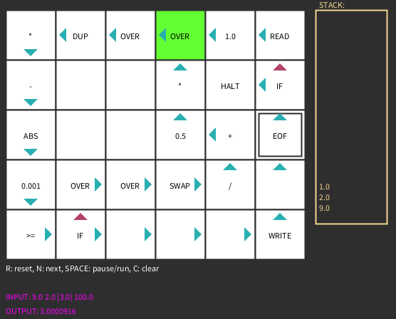

# Visual Forth

Proof of concept of a 2D FORTH Virtual Machine in Processing.

## How to program?

Click the cells to edit the instruction. Type the instruction op-code and enter
to change it, or a number (float) to create a PUSH instruction.

Right click on the cell to change the direction (normal and alternative).

